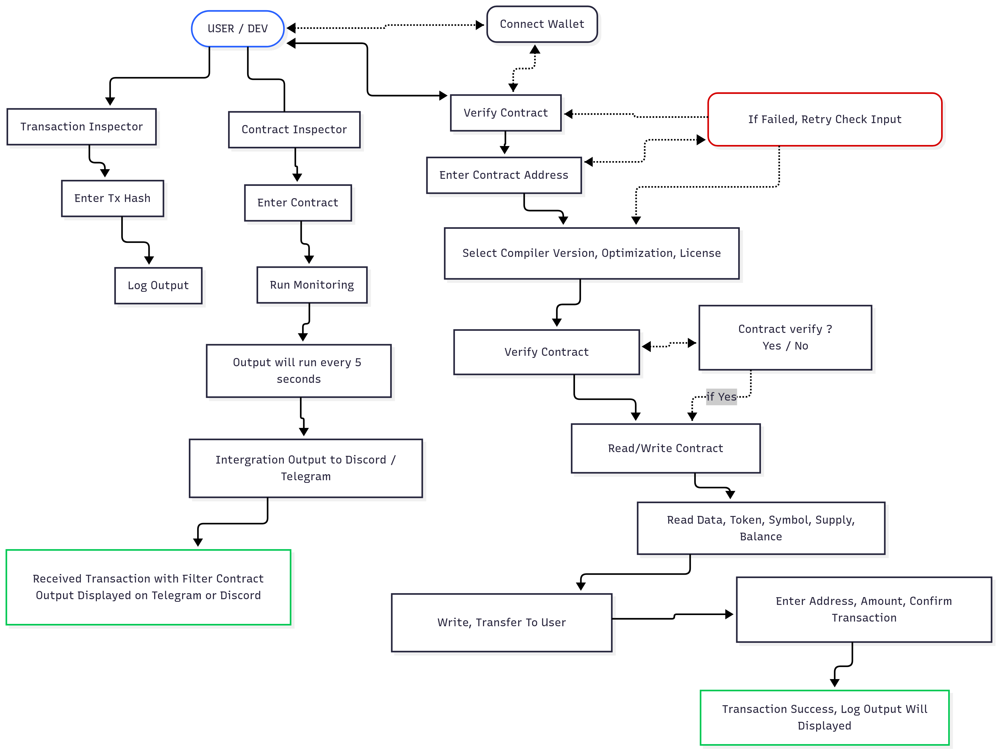

# Somnia Dev Dashboard



## 📋 Deskripsi

**Somnia Dev Dashboard** adalah aplikasi web profesional untuk inspeksi transaksi blockchain dan kontrak pintar pada jaringan Somnia Network. Aplikasi ini menyediakan antarmuka yang intuitif untuk developer dan pengguna blockchain untuk menganalisis, memantau, dan berinteraksi dengan kontrak pintar di Somnia Testnet.

## ✨ Fitur Utama

### 🔍 Transaction Inspector
- **Analisis Transaksi Real-time**: Masukkan hash transaksi untuk melihat detail lengkap
- **Decode Event Logs**: Otomatis mendekode event ERC-20 dan ERC-721
- **Gas Fee Tracking**: Visualisasi riwayat biaya gas dengan chart interaktif
- **Explorer Integration**: Link langsung ke Somnia Explorer

### 🏗️ Contract Inspector
- **Real-time Monitoring**: Pantau kontrak secara real-time dengan polling otomatis
- **Token Information**: Tampilkan informasi token ERC-20 (name, symbol, decimals, total supply)
- **Event Streaming**: Stream event logs dari kontrak yang dipantau
- **Address Profiling**: Klik alamat untuk melihat profil dan balance

### ✅ Contract Verification
- **Source Code Verification**: Verifikasi kontrak dengan source code Solidity
- **Compiler Options**: Dukungan berbagai versi compiler (0.8.18, 0.8.19, 0.8.20)
- **Optimization Settings**: Konfigurasi optimization dan runs
- **License Management**: Pilihan lisensi (MIT, GPL-3.0, Apache-2.0)

### 📝 Contract Interaction
- **Read Functions**: Baca data kontrak (name, symbol, decimals, total supply, balance)
- **Write Functions**: Interaksi dengan kontrak (transfer ERC-20)
- **Wallet Integration**: Koneksi wallet melalui RainbowKit
- **Transaction Management**: Kelola transaksi dengan feedback real-time

## 🛠️ Teknologi yang Digunakan

### Frontend
- **Next.js 14.2.16** - React framework dengan App Router
- **TypeScript** - Type safety dan developer experience
- **Tailwind CSS** - Utility-first CSS framework
- **Radix UI** - Komponen UI yang accessible
- **Recharts** - Library chart untuk visualisasi data

### Blockchain Integration
- **Wagmi** - React hooks untuk Ethereum
- **RainbowKit** - Wallet connection UI
- **Viem** - TypeScript interface untuk Ethereum
- **Ethers.js** - Library untuk berinteraksi dengan blockchain

### Development Tools
- **ESLint** - Code linting
- **PostCSS** - CSS processing
- **Vercel Analytics** - Analytics dan monitoring

## 🚀 Instalasi dan Setup

### Prerequisites
- Node.js 18+ 
- npm atau pnpm
- Wallet browser (MetaMask, WalletConnect, dll)

### 1. Clone Repository
```bash
git clone <repository-url>
cd somtod-fixed
```

### 2. Install Dependencies
```bash
npm install
# atau
pnpm install
```

### 3. Environment Variables
Buat file `.env.local` di root directory:
```env
# WalletConnect Project ID (dapatkan dari https://cloud.walletconnect.com/)
NEXT_PUBLIC_WALLETCONNECT_PROJECT_ID=your_project_id

# Optional: Notification services
TELEGRAM_BOT_TOKEN=your_telegram_bot_token
TELEGRAM_CHAT_ID=your_telegram_chat_id
DISCORD_WEBHOOK_URL=your_discord_webhook_url
```

### 4. Run Development Server
```bash
npm run dev
# atau
pnpm dev
```

Aplikasi akan berjalan di `http://localhost:3000`

### 5. Build untuk Production
```bash
npm run build
npm start
```

## 🌐 Network Configuration

Aplikasi dikonfigurasi untuk **Somnia Testnet**:

- **Chain ID**: 50312
- **RPC URL**: https://dream-rpc.somnia.network
- **Explorer**: https://explorer.somnia.network
- **Native Token**: STT (Somnia Test Token)
- **Decimals**: 18

## 📱 Cara Penggunaan

### 1. Koneksi Wallet
- Klik tombol "Connect Wallet" di header
- Pilih wallet yang didukung (MetaMask, WalletConnect, dll)
- Approve koneksi di wallet Anda

### 2. Analisis Transaksi
- Pilih tab "🔍 Transaction Inspector"
- Masukkan hash transaksi (0x...)
- Klik "🔎 Analyze Transaction"
- Lihat detail transaksi dan event logs

### 3. Monitor Kontrak
- Pilih tab "🏗️ Contract Inspector"
- Masukkan alamat kontrak (0x...)
- Klik "▶️ Start Monitoring"
- Lihat event real-time dan informasi token

### 4. Verifikasi Kontrak
- Pilih tab "✅ Verify Contract"
- Masukkan alamat kontrak dan source code
- Konfigurasi compiler settings
- Klik "✅ Verify Contract"

### 5. Interaksi Kontrak
- Setelah verifikasi berhasil, pilih tab "📝 Read/Write Contract"
- Baca data kontrak (name, symbol, balance, dll)
- Lakukan transfer token ERC-20

## 🏗️ Struktur Proyek

```
somtod-fixed/
├── app/                    # Next.js App Router
│   ├── layout.tsx         # Root layout dengan providers
│   ├── page.tsx           # Main dashboard page
│   ├── providers.tsx      # Wallet dan query providers
│   └── globals.css        # Global styles
├── components/            # Reusable components
│   ├── ui/               # Radix UI components
│   └── theme-provider.tsx
├── lib/                  # Utility libraries
│   ├── somniaClient.ts   # Blockchain client setup
│   ├── decodeHelpers.ts  # Event log decoders
│   ├── notifier.ts       # Notification services
│   └── utils.ts          # General utilities
├── public/               # Static assets
│   ├── flow_somtod.png   # Flowchart diagram
│   └── favicon.png       # App icon
└── scripts/              # Utility scripts
    └── monitor.ts        # Monitoring script
```

## 🔧 Konfigurasi

### WalletConnect Setup
1. Daftar di [WalletConnect Cloud](https://cloud.walletconnect.com/)
2. Buat project baru
3. Copy Project ID ke environment variables
4. Konfigurasi domain yang diizinkan

### Custom Network (Opsional)
Untuk menggunakan network lain, edit `app/providers.tsx`:

```typescript
export const customChain: Chain = {
  id: YOUR_CHAIN_ID,
  name: "Your Network",
  nativeCurrency: {
    name: "Your Token",
    symbol: "YTK",
    decimals: 18,
  },
  rpcUrls: {
    default: { http: ["YOUR_RPC_URL"] },
  },
  blockExplorers: {
    default: {
      name: "Your Explorer",
      url: "YOUR_EXPLORER_URL",
    },
  },
  testnet: true,
};
```

## 🚨 Troubleshooting

### Common Issues

**1. Wallet Connection Failed**
- Pastikan wallet sudah terinstall
- Check network di wallet (harus Somnia Testnet)
- Refresh halaman dan coba lagi

**2. Transaction Not Found**
- Pastikan hash transaksi valid
- Check apakah transaksi ada di Somnia Testnet
- Pastikan RPC endpoint aktif

**3. Contract Interaction Failed**
- Pastikan wallet sudah connect
- Check balance STT untuk gas fee
- Pastikan kontrak address valid

**4. Build Errors**
```bash
# Clear cache dan reinstall
rm -rf node_modules package-lock.json
npm install
npm run build
```

## 🤝 Kontribusi

1. Fork repository
2. Buat feature branch (`git checkout -b feature/amazing-feature`)
3. Commit changes (`git commit -m 'Add amazing feature'`)
4. Push ke branch (`git push origin feature/amazing-feature`)
5. Buat Pull Request

## 📄 Lisensi

Proyek ini menggunakan lisensi MIT. Lihat file `LICENSE` untuk detail.

## 🔗 Links

- **Somnia Network**: https://somnia.network
- **Somnia Explorer**: https://explorer.somnia.network
- **Documentation**: https://docs.somnia.network
- **Discord**: https://discord.gg/somnia

## 👨‍💻 Developer

Dibuat dengan ❤️ untuk komunitas Somnia Network

---

**Catatan**: Aplikasi ini dikhususkan untuk Somnia Testnet. Pastikan Anda menggunakan testnet untuk development dan testing.
